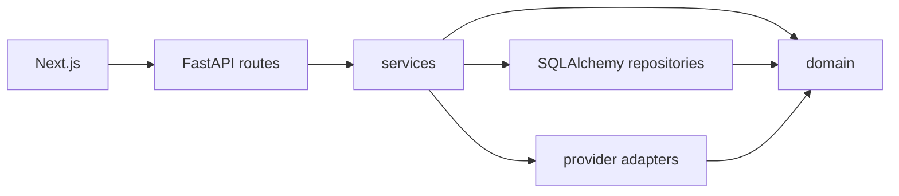

# Architecture

EnergyOS is a Swiss B2B assessment platform. The foundation provides a tenancy shell and the boundaries later workflow code must follow.

## Dependency direction

- `domain` contains values, ports, units, and assumptions. It imports neither FastAPI, SQLAlchemy, nor provider clients.
- `services` are use cases. They call ports. They do not import adapters or ORM models.
- `db` and `integrations` implement ports.
- `composition` chooses adapters from settings.
- API route modules validate input, call one service, and map the response.

## Tenancy

An assessment belongs to one organization. Repository methods that read assessments take the organization id and the assessment id. A request for another organization's assessment returns not found.

`app_user` and `membership` exist so authentication can be added without reshaping the first tables. There is no login flow in this milestone.

## Quantities

Numeric domain outputs use `Quantity`: a decimal value plus a unit. Calculation results use `Result`: a quantity, an assumption set, and an engine version. A result without assumptions is invalid.

Money and tariff rates use `NUMERIC` in PostgreSQL when those tables arrive. Calculation libraries may use floats internally and convert at the domain boundary.

## Geometry

PostGIS is enabled in the first migration. Later building and roof geometry is stored as SRID 2056 (Swiss LV95). APIs that speak to map clients accept WGS84 and convert at the repository boundary.

## Energy and finance

`domain/energy` is for physical calculations. `domain/finance` consumes energy results and tariff schedules as values. Neither package imports the other, and neither imports a Swiss data client.

Prices, tariffs, subsidies, degradation, performance ratio, and self-consumption are data or assumption-set fields. They are not module constants.

## Providers

Settings name each provider. The only registered adapter is `mock`. An unknown name fails configuration. A later Sonnendach or geo.admin adapter is a new class behind the existing port, selected from settings.

## Jobs

Simulations are not implemented. When a calculation is too slow for a request, add a database-backed job before introducing a broker or a solver.
